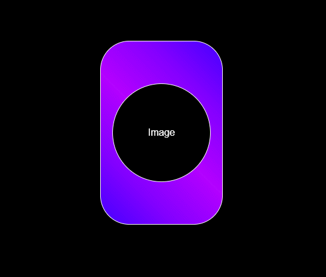

# 3D Card Hover

    This is a simple project that implements that creates a 3D hover effect on a card. The result is an animation that rotates the card in response to mouse movement.

 

 

## Core Technologies

  
  
  

 
