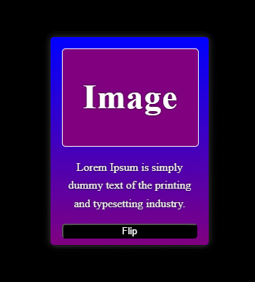

# 3D Card - Flip Hover

This is a simple project that implements a 3D card that rotates when the mouse hovers over it. The card has a front and back that can be switched with a button. The project was built using HTML, CSS and JavaScript.

 

 

## Core Technologies

  
  
  

 
