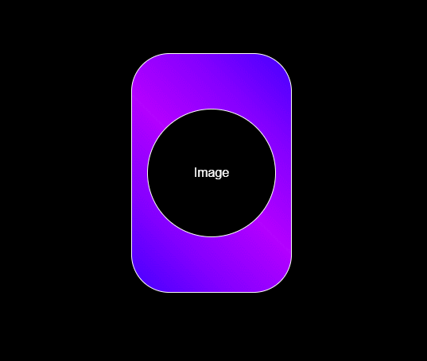
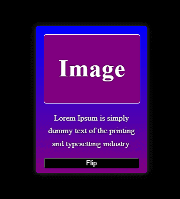

# Cards

<p align="center">
    Projeto Cards
    <br>
    <br>
    <table>
        <thead>
            <tr>
                <th align="center">
                     
                    <p>
                        <small>#</small>
                    </p>
                </th>
                <th align="center">
                     
                    <p> 
                        <small>
                            NAME
                        </small>
                    </p>
                </th>
                <th align="left">
                    
                    <p align="left"> 
                        <small>
                        RELEASE DATE
                        </small>
                    </p>
                </th>
                <th align="center">
                    
                    <p align="center"> 
                        <small>
                        PREVIEW
                        </small>
                    </p>
                </th>
            </tr>
        </thead>
        <tbody>
            <tr>
                <td>01</td>
                <td><a href="01">3D Card </a></td>
                <td>30/04/23</td>
                <td align="center">
                <a href="https://github.com/BVictorsk/Cards/tree/main/3D_Card"></a></td>
            </tr>
            <tr>
                <td>02</td>
                <td><a href="02">3D Flip Card</a></td>
                <td>30/04/23</td>
                <td align="center"><a href="https://github.com/BVictorsk/Cards/tree/main/3D_Flip_Card"></a></td>
            </tr>
        </tbody>
    </table>
</p>

<br/>
<br/>

## Core Technologies
<br/>
<div style="display: inline_block">
  
  
  
</div>

<br/>


<h2 id="clone">Clone</h2>

<h4>Starting</h4>

```
git clone https://github.com/BVictorsk/stopwatch.git
npm install
```


<h2 id="contribute">Contribute 🚀</h2>

If you want to contribute, clone this repo, create your work branch and get your hands dirty!

```bash
git clone https://github.com/BVictorsk/Cards.git
git checkout -b feature/NAME
```

 At the end, open a Pull Request explaining the problem solved or feature made, if exists, append screenshot of visual modifications and wait for the review!

[How to create a Pull Request](https://www.atlassian.com/br/git/tutorials/making-a-pull-request)

[Commit pattern](https://gist.github.com/joshbuchea/6f47e86d2510bce28f8e7f42ae84c716)


<h2 id="license">License 📃 </h2>

This project is under MIT license
