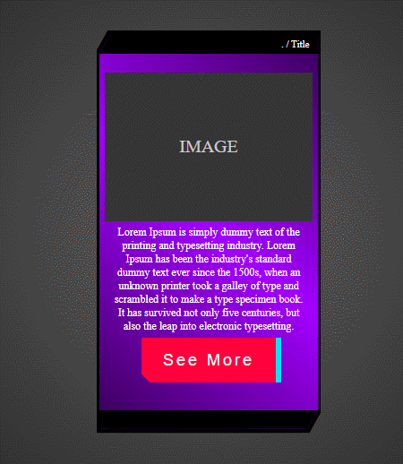

# Polygon Card - Cyberpunk

    This is a CSS code that styles a card with a glitch effect. The card has a dark background and is shaped with a polygon clip-path. The content is centered in the card with a flexbox layout. The card header and footer have a black background color, while the card container has a gradient color from purple to black. The card has an image and a text section that are styled with background colors, font sizes, and other properties.

 

 

## Core Technologies

  
  
  

 
